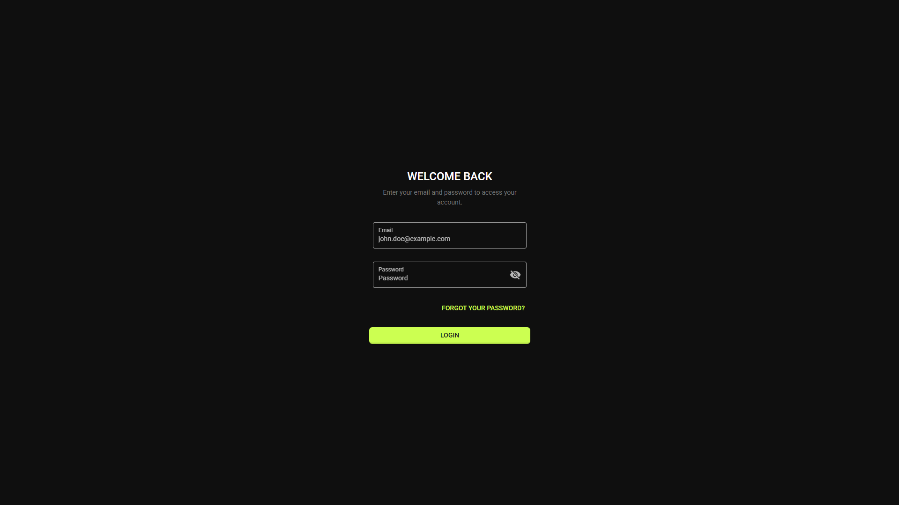
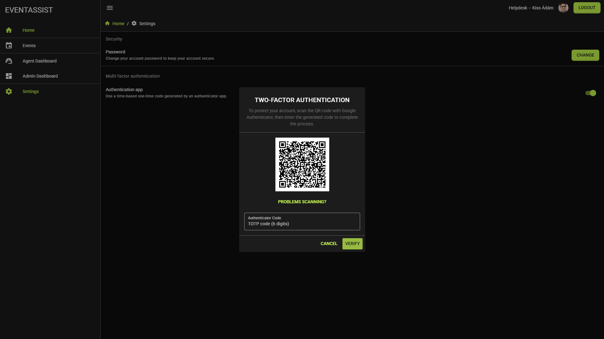
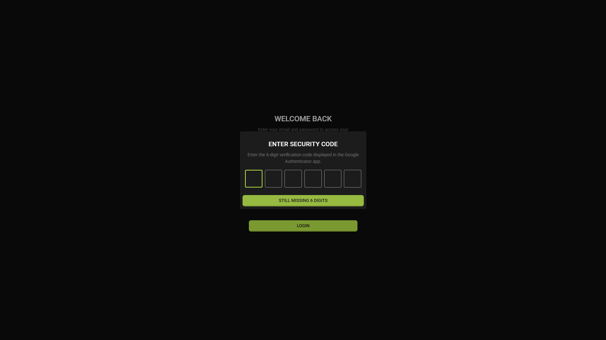
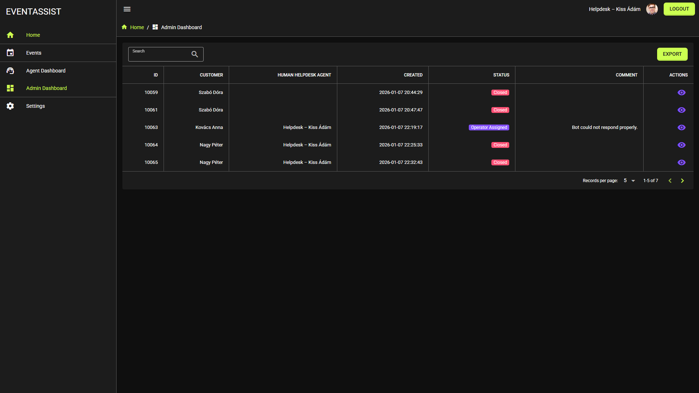
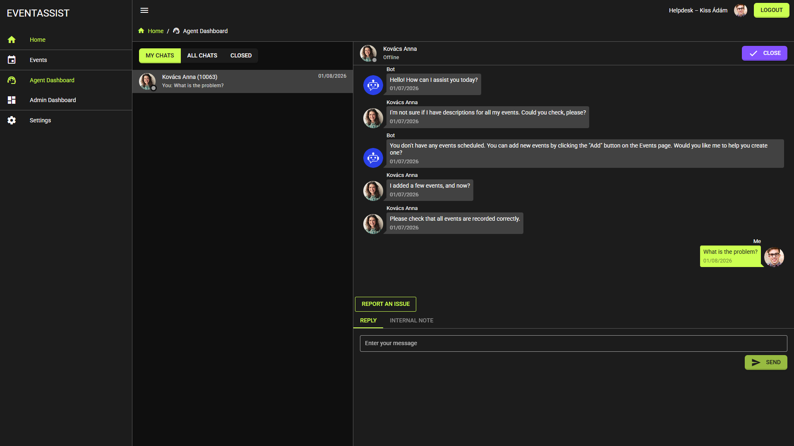
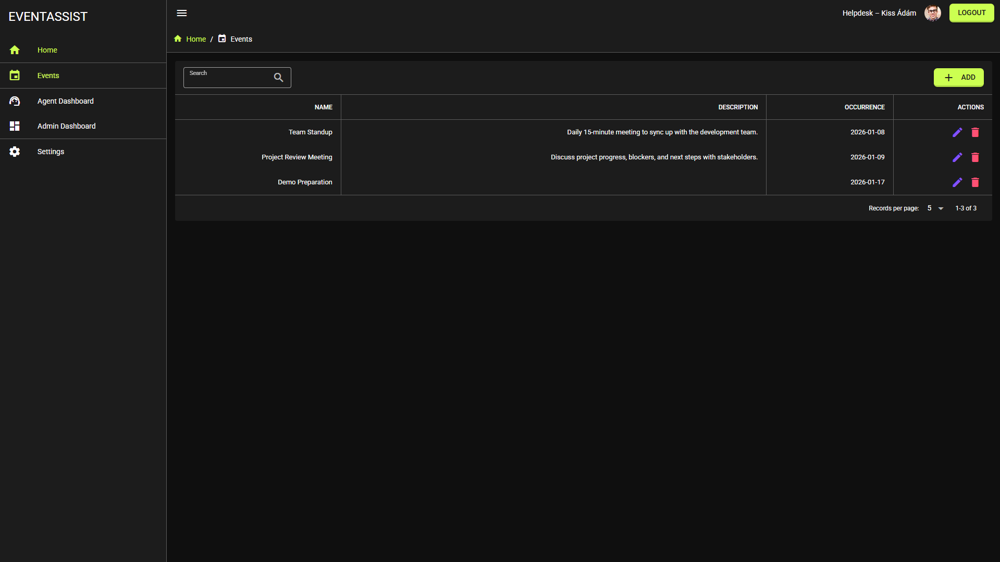
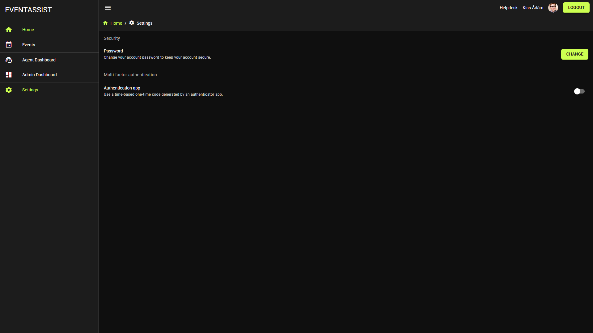

# EventAssist

EventAssist is a web-based event management system complemented by an AI-powered customer support chatbot. The goal of the system is to simplify event management and user support through a unified, automated interface.

The chatbot is able to create new events, summarize existing events, and close conversations. Administrators can monitor conversations in real time and take over from the AI whenever necessary. Every interaction is logged, ensuring full traceability.

The application includes login, two-factor authentication, and password reset functionality to ensure secure access.

📊 **[View the project presentation](https://docs.google.com/presentation/d/1QNJnhnNqjId8eCh3LsJZJn26MmFEDb9CJo8J3I0Ec_k/edit?usp=sharing)**

## Screenshots

### Login


### Two-Factor Authentication
Two-factor authentication is implemented using **Google Authenticator**.




### Admin Dashboard


### Agent Dashboard


### Events


### Settings


## Tech Stack

- **Frontend:** Vue 3, Quasar Framework
- **Backend:** ASP.NET 10
- **AI Chatbot:** Google Gemini API
- **Email Service:** Google SMTP Server
- **Database Management:** Entity Framework Core (ORM)
- **Authentication:** JWT
- **Real-Time Communication:** SignalR (chat)

> **Note:** There is currently no registration through the UI — new users can only be created via the API.

## Running the Application

A MSSQL database needs to be created, and the connection string must be set in the `appsettings.json` file. After that, the backend migrations need to be applied using the `Update-Database` command in the Package Manager Console.

To use the Google Gemini API, an API key must be created in [Google AI Studio](https://aistudio.google.com/app/api-keys) and configured in the `appsettings.json` file as well.

For the email sending feature to work, Google SMTP credentials (username and password) are required. It is recommended to use an [App Password](https://myaccount.google.com/apppasswords) for this. These credentials are also configured in the `appsettings.json` file.

For JWT-based authentication, a 256-bit (32-byte) cryptographically random secret key is required, provided as a 64-character hex string.

## Running the Frontend

First, install the dependencies:

```bash
npm install
```

Then start the development server with:

```bash
npm run dev
```

## Important Note

Sensitive data configured in `appsettings.json` (API keys, SMTP credentials, JWT secret, etc.) must **not** be committed to version control (Git).

It is recommended to use **User Secrets** in the development environment, and **environment variables** in production.
